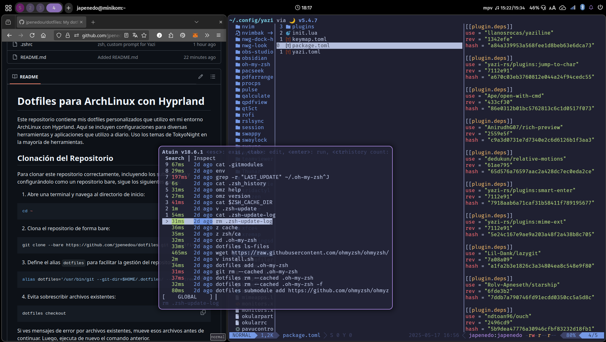

# Dotfiles en ArchLinux y Hyprland

Este repositorio contiene mis dotfiles personalizados que utilizo en mi entorno ArchLinux con Hyprland. Aquí se incluyen configuraciones para diversas herramientas y aplicaciones que utilizo a diario. Uso los temas de TokyoNight en la mayoría de herramientas.

<p align="center">
  
</p>

## Instalación

Para clonar este repositorio correctamente sigue los siguientes pasos:

1. Clona el repositorio:

```shell
git clone --bare https://github.com/jpenedou/dotfiles.git ~/.dotfiles
```

2. Define el alias `dotfiles` para facilitar la gestión del repositorio:

```shell
alias dotfiles='/usr/bin/git --git-dir=$HOME/.dotfiles/ --work-tree=$HOME'
```

3. Evita sobrescribir archivos existentes:

```shell
dotfiles checkout
```

> ⚠️ **Aviso:** Si ves mensajes de error por archivos existentes, mueve esos archivos antes de continuar. Luego, ejecuta de nuevo el comando anterior. Si estás seguro puedes sobrescribir con --force

4. Establece el repositorio para no mostrar archivos no rastreados:

```shell
dotfiles config --local status.showUntrackedFiles no
```

5. Actualiza los submódulos:

```shell
dotfiles submodule update --init --recursive
```

---

## Herramientas Utilizadas

* **[Hyprland](https://hyprland.org/)**: Compositor dinámico para Wayland con soporte para tiling y floating windows.
* **[Rofi](https://github.com/lbonn/rofi)**: Lanzador de aplicaciones, menú y selector de ventanas personalizable.
* **[Waybar](https://github.com/Alexays/Waybar)**: Barra de estado y sistema personalizable para Wayland. (**Obsoleto**)
* **[DMS (DankMaterialShell)](https://github.com/AvengeMedia/DankMaterialShell)**: Un completo shell de escritorio para niri, Hyprland, MangoWC, Sway y otros compositores Wayland.
* **[Zsh + Oh My Zsh](https://ohmyz.sh/)**: Shell interactivo con mejoras sobre Bash y numerosas extensiones.
* **[Atuin](https://github.com/ellie/atuin)**: Historial de shell avanzado con sincronización y búsqueda mejorada.
* **[Kitty](https://sw.kovidgoyal.net/kitty/)**: Emulador de terminal GPU acelerado, rápido y altamente configurable.
* **[LazyVim](https://lazyvim.org/)**: Configuración avanzada para Neovim que facilita el uso de plugins y personalización.
* **[Yazi](https://github.com/sxyazi/yazi)**: Explorador de archivos rápido y minimalista basado en la línea de comandos.
* **[Lazygit](https://github.com/jesseduffield/lazygit)**: Interfaz de usuario para Git en la terminal, simple y altamente funcional.

---

> *Para más detalles sobre cada herramienta y configuración específica, revisa los archivos correspondientes en este repositorio. Algunas herramientas ya no se usan pero  se mantiene su configuración.*
