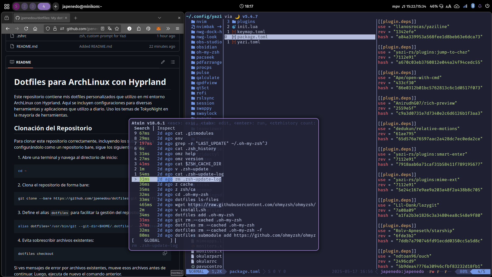

# Dotfiles en ArchLinux y Hyprland

Este repositorio contiene mis dotfiles personalizados que utilizo en mi entorno ArchLinux con Hyprland. Aquí se incluyen configuraciones para diversas herramientas y aplicaciones que utilizo a diario. Uso los temas de TokyoNight en la mayoría de herramientas.

<p align="center">
  
</p>

## Instalación

Para clonar este repositorio correctamente sigue los siguientes pasos:

1. Clona el repositorio:

```shell
git clone --bare https://github.com/jpenedou/dotfiles.git ~/.dotfiles
```

2. Define el alias `dotfiles` para facilitar la gestión del repositorio:

```shell
alias dotfiles='/usr/bin/git --git-dir=$HOME/.dotfiles/ --work-tree=$HOME'
```

3. Evita sobrescribir archivos existentes:

```shell
dotfiles checkout
```

> ⚠️ **Aviso:** Si ves mensajes de error por archivos existentes, mueve esos archivos antes de continuar. Luego, ejecuta de nuevo el comando anterior. Si estás seguro puedes sobrescribir con --force

4. Establece el repositorio para no mostrar archivos no rastreados:

```shell
dotfiles config --local status.showUntrackedFiles no
```

5. Actualiza los submódulos:

```shell
dotfiles submodule update --init --recursive
```

---

## Herramientas Utilizadas

* **[Niri](https://github.com/YaLTeR/niri)**: Compositor Wayland scrollable-tiling. Reemplazó a Hyprland.
* **[DMS (DankMaterialShell)](https://github.com/AvengeMedia/DankMaterialShell)**: Shell de escritorio completo (launcher, clipboard, notificaciones, audio, brillo, lock screen, etc.).
* **[Kitty](https://sw.kovidgoyal.net/kitty/)**: Emulador de terminal GPU acelerado, rápido y altamente configurable.
* **[Zsh + Oh My Zsh](https://ohmyz.sh/)**: Shell interactivo. Prompt con [Starship](https://starship.rs/), autosuggestions, syntax highlighting, y otras extensiones.
* **[Neovim + LazyVim](https://lazyvim.org/)**: Editor de texto con configuración avanzada y ecosistema de plugins.
* **[Yazi](https://github.com/sxyazi/yazi)**: Explorador de archivos rápido y minimalista basado en la línea de comandos.
* **[Lazygit](https://github.com/jesseduffield/lazygit)**: Interfaz TUI para Git, simple y altamente funcional.
* **[Atuin](https://github.com/ellie/atuin)**: Historial de shell avanzado con sincronización y búsqueda mejorada.
* **[fzf](https://github.com/junegunn/fzf)**: Fuzzy finder para búsqueda interactiva en terminal.
* **[zoxide](https://github.com/ajeetdsouza/zoxide)**: Navegador de directorios inteligente que aprende de tu uso.
* **[zellij](https://zellij.dev/)**: Multiplexor de terminal con layout workspace.
* **[Tridactyl](https://tridactyl.xyz/)**: Extensión tipo Vim para Firefox (navegación, atajos, comandos).
* **[OpenCode](https://opencode.ai/) + [oh-my-opencode-slim](https://github.com/opencode-ai/oh-my-opencode-slim)**: CLI de IA para desarrollo con agents. Plugins: [`@slkiser/opencode-quota`](https://github.com/slkiser/opencode-quota), [`@tarquinen/opencode-dcp`](https://github.com/Tarquinen/opencode-dynamic-context-pruning).
---

> *Para más detalles sobre cada herramienta y configuración específica, revisa los archivos correspondientes en este repositorio. Algunas herramientas ya no se usan pero  se mantiene su configuración.*
